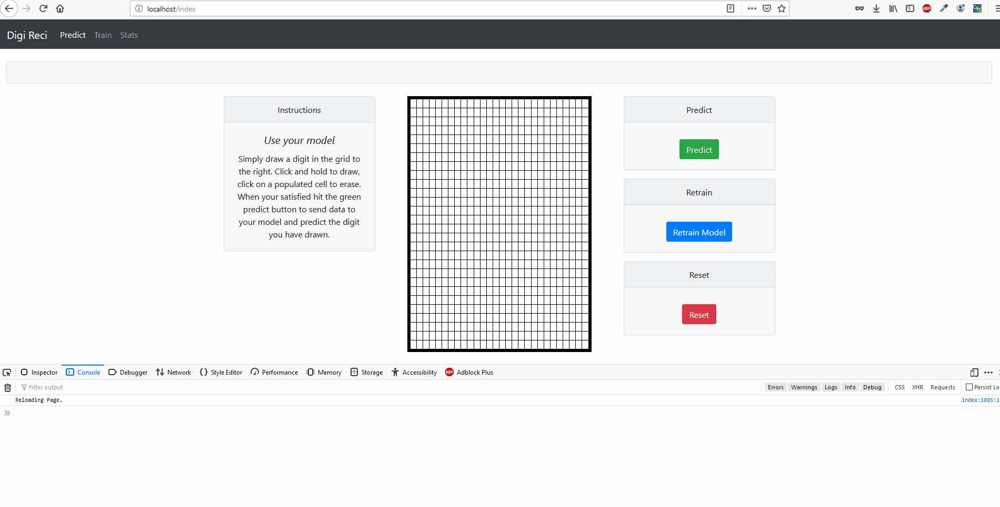

# DigiReci

Inspired by the Kaggle challenge <a href="https://www.kaggle.com/c/digit-recognizer" target="_blank"> Digit Recognizer</a>, I wanted to develop a front end web application that could be used to help train and analyze a models performance.

The challenge is given a matrix of 783 pixels ( 28 x 28 grid of pixels), build a machine learning algorithm to identify the digit this is a classification and computer vision fundamentals type of problem.

This is the reason I designed Digit Reci, to provide a simple user interface to train test and analyze model performance.

Docker : https://hub.docker.com/r/ianfogelman/digireci

